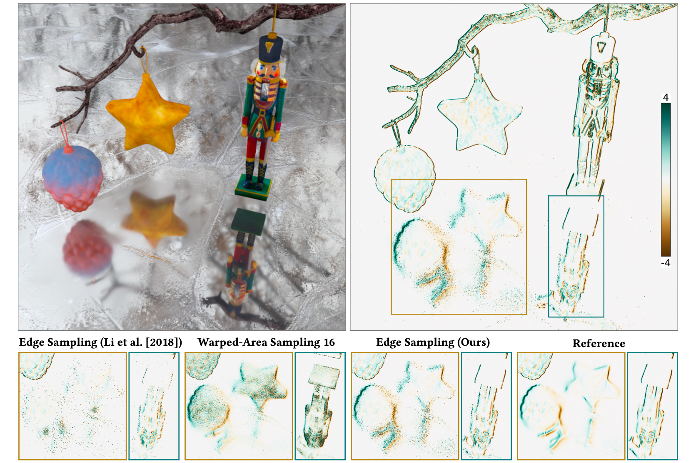

## Quadric-Based Silhouette Sampling for Differentiable Rendering



This repository contains the source code for the [Quadric-Based Silhouette Sampling for Differentiable Rendering](https://mariasoroka.github.io/papers/EdgeSampling.html) by Mariia Soroka, Christoph Peters, and Steve Marschner.

It is based on the [experimental branch of redner](https://github.com/BachiLi/redner/tree/experimental), which includes implementations of the paper [Differentiable Monte Carlo Ray Tracing through Edge Sampling](https://people.csail.mit.edu/tzumao/diffrt/) by Tzu-Mao Li, Miika Aittala, Fredo Durand, and Jaakko Lehtinen, as well as an implementation of [Unbiased Warped-Area Sampling for Differentiable Rendering](https://people.csail.mit.edu/sbangaru/projects/was-2020/index.html) by Sai Praveen Bangaru, Tzu-Mao Li, and Fredo Durand.


## Installation

To compile, clone this repository with all submodules, check out the `quadric_sampling` branch and run:

```
python setup.py install
```

## How to run

The scripts used to compute the gradient images in the paper are available in [this repository](https://github.com/mariasoroka/QuadricBasedSilhouetteSamplingExperiments).

## Other boundary sampling methods

To use the edge sampling method by Li et al. with the fixed v-sphere rejection test (see Appendix F of the "Quadric-Based Silhouette Sampling for Differentiable Rendering" paper), check out the `hough_transforms` branch.

In addition to fixing some bugs, `quadric_sampling` branch also extends the WAS implementation by Bangaru et al. to support the distance function introduced in "Warped-Area Reparameterization of Differential Path Integrals" by Xu et al.

## Dependencies

This repository inherits redner dependencies:
- [Python 3.6 or above](https://www.python.org)
- [pybind11](https://github.com/pybind/pybind11)
- [PyTorch 1.0 or above](https://pytorch.org) (optional, required if TensorFlow is not installed)
- [Tensorflow 2.0](https://www.tensorflow.org/) (optional, required if PyTorch is not installed)
- [Embree](https://embree.github.io)
- [CUDA 10](https://developer.nvidia.com/cuda-downloads) (optional, need GPU at Kepler class or newer)
- [optix prime V6.5 or older](https://developer.nvidia.com/optix) (optional, required when compiled with CUDA)
- [Thrust](https://thrust.github.io)
- [miniz](https://github.com/richgel999/miniz)
- [xatlas](https://github.com/jpcy/xatlas)
- A few other python packages: numpy, scikit-image, and imageio

And, additionally, requires:
- [CointUtils](https://github.com/coin-or/CoinUtils.git)
- [Clp](https://github.com/coin-or/Clp.git)


CoinUtils and Clp will be compiled by the setup.py script. They can be also compiled manually:
```
# from ./CoinUtils directory
./configure -C --prefix=./CoinUtils
make
make install
```

```
# from ./Clp directory
./configure -C --prefix=./Clp PKG_CONFIG_PATH=./CoinUtils/lib/pkgconfig
make
make install
```

## Citation

```
@article{Soroka2025QuadricBasedSampling,
title = {Quadric-Based Silhouette Sampling for Differentiable Rendering},
author = {Soroka, Mariia and Peters, Christoph and Marschner, Steve},
year = {2025},
issue_date = {August 2025},
publisher = {Association for Computing Machinery},
volume = {44},
number = {4},
doi = {10.1145/3731146},
journal = {ACM Trans. Graph.},
month = jul
}
```
